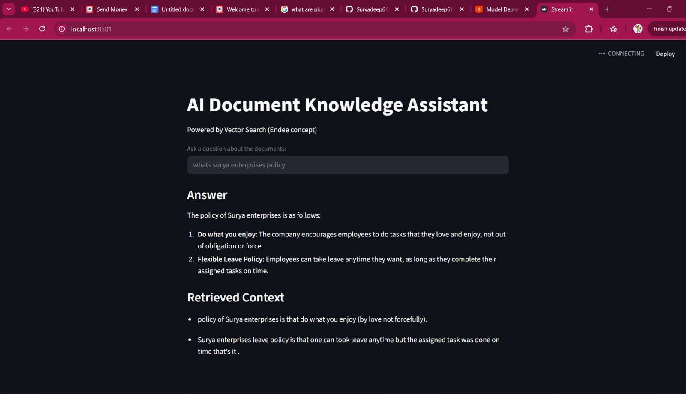

# AI Document Knowledge Assistant using RAG and Vector Search

## Project Overview

This project implements an **AI-powered document knowledge assistant** using a **Retrieval Augmented Generation (RAG)** pipeline.  
The system allows users to query documents using natural language and receive context-aware answers generated by a Large Language Model (LLM).

The system works by converting documents into **vector embeddings**, performing **semantic similarity search**, retrieving the most relevant document chunks, and then passing them to an LLM to generate accurate answers.

This project demonstrates how **vector databases such as Endee can power scalable semantic search and AI-driven applications**.

---

# Problem Statement

Traditional keyword-based search systems often fail to capture the **semantic meaning** of user queries. As a result, they may return irrelevant results even when the query is conceptually related to the stored documents.

Modern AI applications require:

- Semantic search
- Efficient similarity retrieval
- Context-aware responses

This project addresses this problem by implementing a **vector-based retrieval system combined with a generative AI model** to provide accurate answers from document knowledge.

---

# System Architecture

The system follows a **Retrieval Augmented Generation (RAG) architecture**.

User Query
↓
Embedding Model (SentenceTransformers)
↓
Vector Similarity Search
↓
Retrieve Top-K Relevant Documents
↓
Context Injection
↓
Groq LLaMA 3.1 LLM
↓
Generated Answer

---

# Technical Approach

The system is implemented in the following stages:

### 1. Document Processing

Input documents are stored in a text file and loaded into the system (documents can be company policy / your notes/ personal stuff / anything in text ).

### 2. Embedding Generation

Documents are converted into vector embeddings using: SentenceTransformer model: all-MiniLM-L6-v2

This model generates **384-dimensional embeddings** representing the semantic meaning of the text.

### 3. Vector Storage

Embeddings are stored in a vector index that enables similarity search.

### 4. Semantic Search

When a user query is submitted:

- The query is converted into an embedding
- Similarity search retrieves the most relevant document chunks

### 5. Retrieval Augmented Generation

The retrieved context is passed to a **Large Language Model (Groq LLaMA 3.1)** which generates the final answer.

---

# How Endee Vector Database is Used

Endee is a **next-generation vector database designed for scalable semantic search and AI workloads**.

In production systems, Endee would be responsible for:

- Storing large-scale embeddings
- Performing ultra-fast vector similarity search
- Supporting real-time AI applications

In this prototype implementation, a lightweight vector store is used to simulate the embedding indexing process while demonstrating the **Endee-compatible architecture for vector search and retrieval pipelines**.

The project architecture is designed so that the vector indexing layer can be replaced directly with the Endee vector database for large-scale deployments.

---

# Installation and Setup

### 1. Clone the repository

git clone https://github.com/suryadeep123/endee.git

cd endee/ai-rag-assistant

### 2. Install dependencies

pip install -r requirements.txt

### 3. Configure environment variables

Create a `.env` file in the project root.
put this in .env file : GROQ_API_KEY=your_api_key_here

### 4. Run the application

python -m streamlit run app.py

### The application will be available at:

http://localhost:8501

The system also displays the retrieved context used to generate the response.

## 

# Technologies Used

- Python
- SentenceTransformers
- Streamlit
- Groq LLaMA 3.1
- Vector Similarity Search
- Retrieval Augmented Generation (RAG)

---

# Key Features

- Semantic document search
- Retrieval Augmented Generation pipeline
- Vector embedding indexing
- LLM-powered answer generation
- Interactive Streamlit interface

---

# Future Improvements

- Support for multiple document formats (PDF, DOCX)
- Scalable indexing for large datasets
- Real-time streaming responses

---

# Conclusion

This project demonstrates how **vector embeddings, semantic search, and large language models can be combined to build intelligent document retrieval systems**.

By integrating vector search with generative AI models, systems like this can power **knowledge assistants, enterprise search tools, and recommendation systems** at scale.

The architecture is designed to integrate seamlessly with **Endee's high-performance vector database for production-grade AI applications**.
